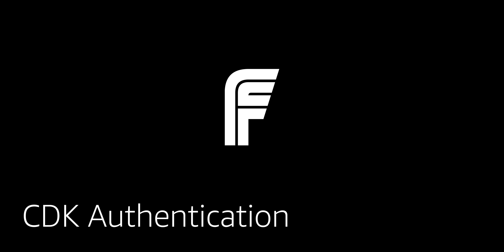

## CDK Authentication

This CDK project deploys an Amazon Cognito User Pool configured to create the infrasstructure for a basic application for user authentication. It is paired with a React front-end for a full-stack serverless project.

### Deploying the back end

1. Clone the repo

```sh
git clone git@github.com:full-stack-serverless/cdk-authentication.git
```

2. Change into the `cdk-authentication` directory

3. Install dependencies in main folder:

```sh
npm install

# or

yarn
```

3. Deploy to AWS

```sh
cdk deploy
```

Once the project has been deployed, you'll be given the resources needed to configure the client-side React application.

```sh
Outputs:
CdkAppsyncChatStack.UserPoolClientId = your_userpool_client_id
CdkAppsyncChatStack.UserPoolId = us-east-1_your_userpool_id
  ```

### Deploying the front end

1. Clone the client application

```sh
git clone https://github.com/full-stack-serverless/react-custom-authentication-aws.git
```

3. Change into the client directory and install dependencies:

```sh
cd react-custom-authentication-aws

npm install

# or

yarn
```

4. Open __src/aws-exports-example.js__ and update with the outputs from CDK.

5. Rename __aws-exports-example.js__ to __aws-exports.js__.

5. Run the app

```sh
npm start
```